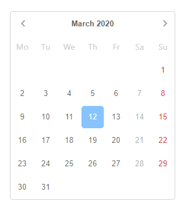
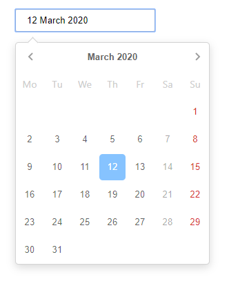

# B5kDatepicker

This project was generated with [Angular CLI](https://github.com/angular/angular-cli) version 8.3.21.

Based on project [https://github.com/tomblachut/skimmed-datepicker](https://github.com/tomblachut/skimmed-datepicker)

## Demo

[https://stackblitz.com/edit/b5k-datepicker](https://stackblitz.com/edit/b5k-datepicker)

## Screenshots

Inline mode



Popup mode



## Features

- select only years, months or day
- popover or inline mode
- ngModel binding
- reactive forms

## Install

`npm i b5k-datepicker --save`

Import module

```ts
import { BrowserModule } from '@angular/platform-browser';
import { NgModule } from '@angular/core';
import { BrowserAnimationsModule } from '@angular/platform-browser/animations';

import { AppComponent } from './app.component';
import {B5kDatepickerModule, B5kDatepickerConfig} from 'b5k-datepicker';


import { FormsModule } from '@angular/forms';
import {pl} from 'date-fns/locale';


const DatepickerConfig: B5kDatepickerConfig = {
  locale: pl
}

@NgModule({
  declarations: [
    AppComponent
  ],
  imports: [
    BrowserModule,
    FormsModule,
    B5kDatepickerModule.forRoot(DatepickerConfig),
    BrowserAnimationsModule
  ],
  bootstrap: [AppComponent]
})
export class AppModule { }
```

## Usage

```html
<input type="text" b5kDatepicker>
```

### Get selected date

- from event
  
  `<input type="text" b5kDatepicker (dateChange)="dateChangeEvent($event)">`

- ngModel

  `<input type="text" b5kDatepicker [(ngModel)]="dateModel">`

- reactive Forms

  `<input type="text" b5kDatepicker inlineMode=true formControlName="date">`

## Configuration

Global in module form root ( [B5kDatepickerConfig](projects/b5k-datepicker/src/lib/B5kDatepickerConfig.ts) )

This settings is optional.

```ts
const DatepickerConfig: B5kDatepickerConfig = {
  locale: pl
}

@NgModule({
  declarations: [...],
  imports: [
    B5kDatepickerModule.forRoot(DatepickerConfig),
  ],
  bootstrap: [...]
})
export class AppModule { }
```

Localization

Datepicker localization is based on `date-fns`. Just import lang file into module.
Default language is english `enGB`, so you don't have to  import than language file.

If you want to change language set it in global configuration of module.

```ts
import {pl} from 'date-fns/locale';

const DatepickerConfig: B5kDatepickerConfig = {
  locale: pl
}
```

## Options

`<input type="text" b5kDatepicker [(ngModel)]="monthModel" [view]="view" [modelFormatter]="monthModelFormatter"  [selectOnlyMonths]=true>`

| Property         | Type         | Default | Description                                                                                  |
|------------------|--------------|---------|----------------------------------------------------------------------------------------------|
| date | Date | -- | Initial date |
| inlineMode       | boolean       | false   | Always visible  |
| modelFormatter   | function      | --       | Function you can format ngModel date.                                            |
| dayFormat	     | string      | d      | Day format in day view,     https://date-fns.org/v2.10.0/docs/format                                                                   |
|monthFormat | string | LLL | Format month names in month view. |
|headingFormat | string | LLLL y | Format date in month heading, eg. February 2020.
|weekStart|WeekDay|WeekDay.Monday| `import { WeekDay } from '@angular/common';`
|view|[ViewMode](projects/b5k-datepicker/src/lib/datepicker/view-mode.ts)|ViewMode.Days|`import { ViewMode } from './view-mode';`|
|selectOnlyMonths|boolean|false| If `selectOnlyMonths = true` and `view = ViewMode.Months`, you can only select month.|
|selectOnlyYears|boolean|false| If `selectOnlyYears = true` and `view = ViewMode.Years` you can only select years.|       

## Events

`<input type="text" b5kDatepicker [(ngModel)]="model" (dateChange)="selectedDate($event)">`

| Property         | Type          | Description |
|------------------|---------------|-------------|
| dateChange       | Date          | Emitted event when date are selected.  |

## Todo

- disable date/dates/date ranges/weekends/weekdays
- date range selection

## Development

Build library and watch for changes `ng build b5k-datepicker --watch`

Run `ng serve` for a dev server. Navigate to `http://localhost:4200/`. The app will automatically reload if you change any of the source files.

## License

MIT